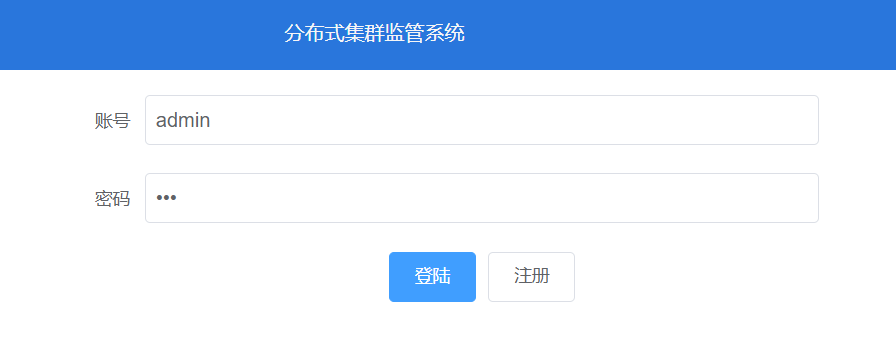
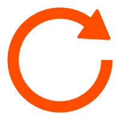
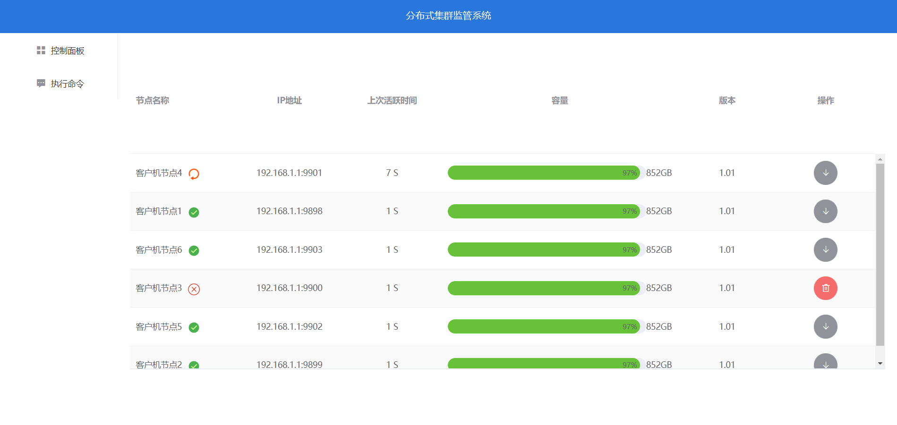
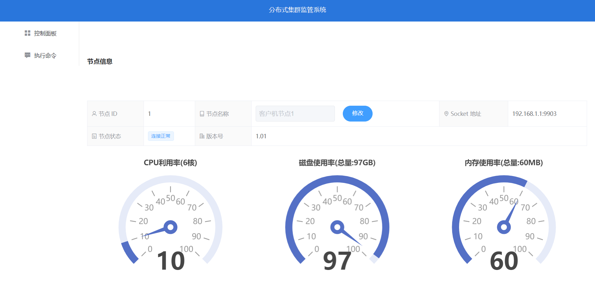
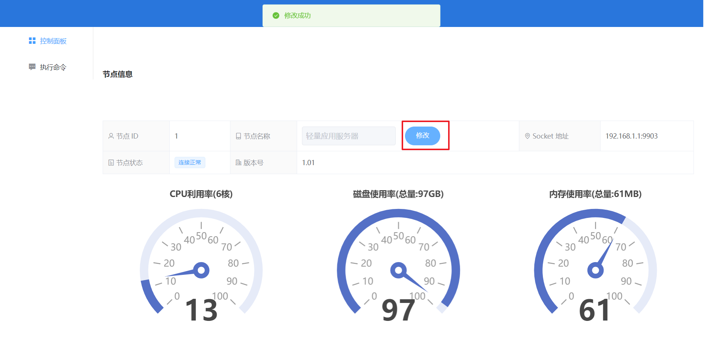
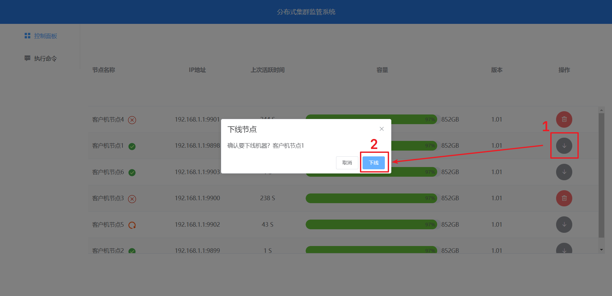
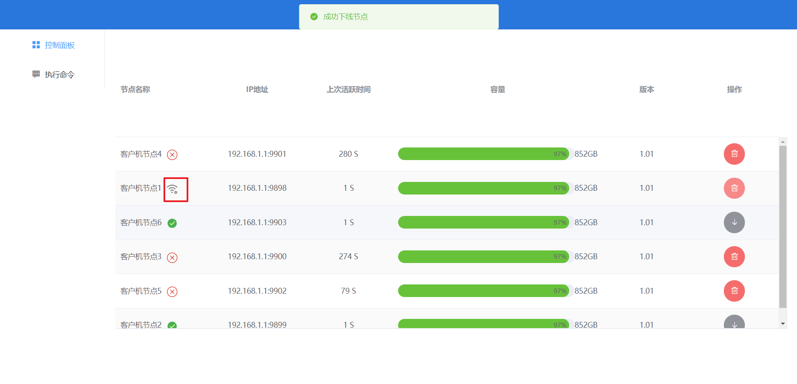
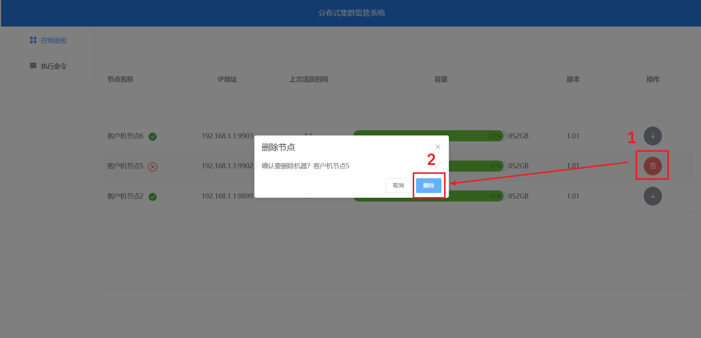
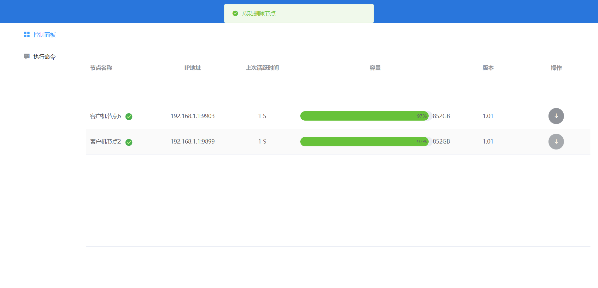

# 分布式集群管理系统

> Author: [Yu-Bar](https://github.com/Yu-Bar)
>
> Date: 2023.12.31
>
> QQ: 1196502856


## 1 简介

本项目是一个分布式监控管理系统，方便用户随时了解分布式集群的情况（机器的状态）以及及时进行各种机器的操作

### 1.1 技术选型

- 后端：JDK17 + SpringBoot3 + Redis
- 前端：vue2 + nodejs + router + store


## 2 使用说明

- 后端：

  1. 配置参数 redis 相关参数：配置好 WebServer 和 SocketServer 中的 application.yml 文件

  ```yaml
  spring:
    data:
      redis:
        host: ${cs.redis.host:localhost}
        port: ${cs.redis.port:6379}
        password: ${cs.redis.password:123}
        database: ${cs.redis.database:0}
  ```

  2. 配置 socket 服务器地址：需要给 web 服务器和 client 客户机配置好 socket 服务器的地址

  ```yml
  cs:
    socket:
      host: ${cs.socket.host}
  ```

  

- 前端：

  环境：nodejs: v20.9.0 

  1. 项目使用npm进行包管理，执行下面的命令下载所需依赖

     ```bash
     npm install
     ```

  2. 修改 `src/service/request.js` 文件中的请求基地址为你的后端服务器地址

     ```js
     // 请求基地址
     const BASE_URL = 'http://localhost:9090';
     ```

  3. 修改 `src/views/mainview/DashBoardView.vue` 文件中的 WebSocket 连接地址为你后端连接的 WebSocket 端点位置

     ```bash
      path: 'ws://localhost:9090/ws/',
     ```

  4. 启动项目

     ```bash
      npm run serve
     ```

     


## 3 模块功能

### 3.1 登陆

使用 JWT 令牌机制来实现权限校验




### 3.2 控制面板

客户机定时向 socket 服务器发送心跳包，socket 服务器将最新节点信息更新到 Redis 服务器，之后用户通过和 Web 服务器建立 websocket 连接，Web服务器向用户推送 Redis 中最新的节点信息。


在控制面板下可以监控节点的部分实时信息：

- 节点名称
- 节点状态
  - 正常节点 
  - 主动下线节点 
  - 异常节点 
  - 重连节点 
- 节点地址
- 上次活跃时间
- 磁盘使用率/磁盘总容量
- 版本号




### 3.3 节点详细信息查看

点击节点名称后可以查看节点详细信息：

- 节点id
- 节点名称
- 节点地址
- 节点状态
- 版本号
- CPU利用率/核数
- 磁盘使用率/磁盘总容量
- 内存使用率/内存总容量




### 3.4 修改节点信息

可以在节点详细信息页对节点进行配置，目前只支持修改节点名称




### 3.5 下线节点

下线节点是用户先向 Web 服务器发起请求，然后 Web 服务器把操作请求传递给 Socket 服务器， Socket 服务器再让指定的客户机执行相应的操作

在控制面板下可以下线**在线节点**和**重连节点** 






### 3.6 删除节点

在控制面板下可以删除**异常节点**和**主动下线节点** 



